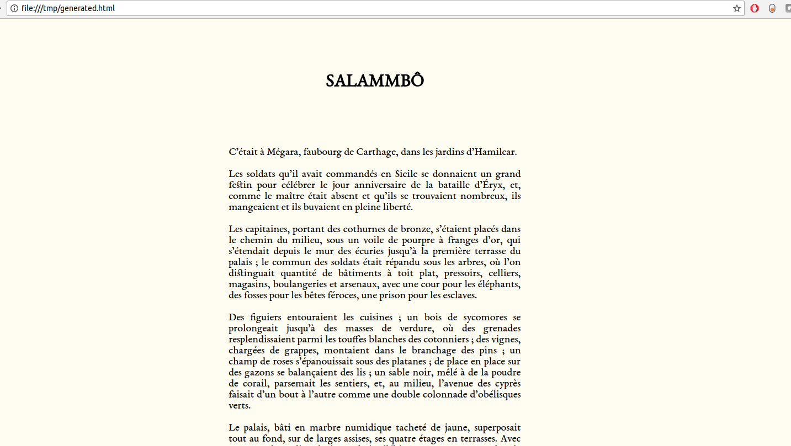

# nice-reader

Small app that takes any text file as input, and displays it nicely in Google Chrome.

<div align="center">

</div>

## Installation

You need to have [Google Chrome](https://www.google.com/chrome/browser/desktop/index.html) installed on your device.  
To install `nice-reader`, you just have to run :

```bash
sudo bash install.sh
```

## Usage

This app is meant to provide a quick way to display any text within a browser.

```bash
nice-reader textFile/to/read  # run with default style (-p)
nice-reader textFile/to/read -r|-p|-1  # run with a specific style
```

There are 3 available styles for now :  

- -p|--pleiade : style loosely based on the one of the famous French publishing house [NRF](http://www.lanrf.fr/)
- -r|--reversed : dark version of the last theme
- -1|--1980 : old-website like
